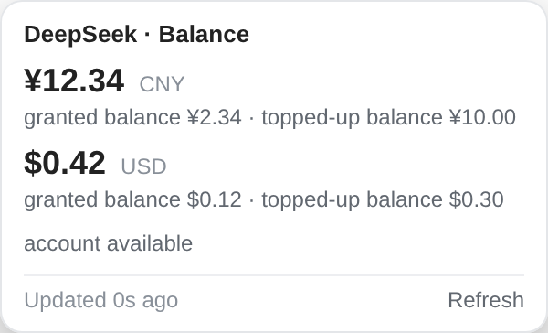
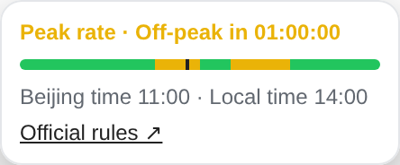
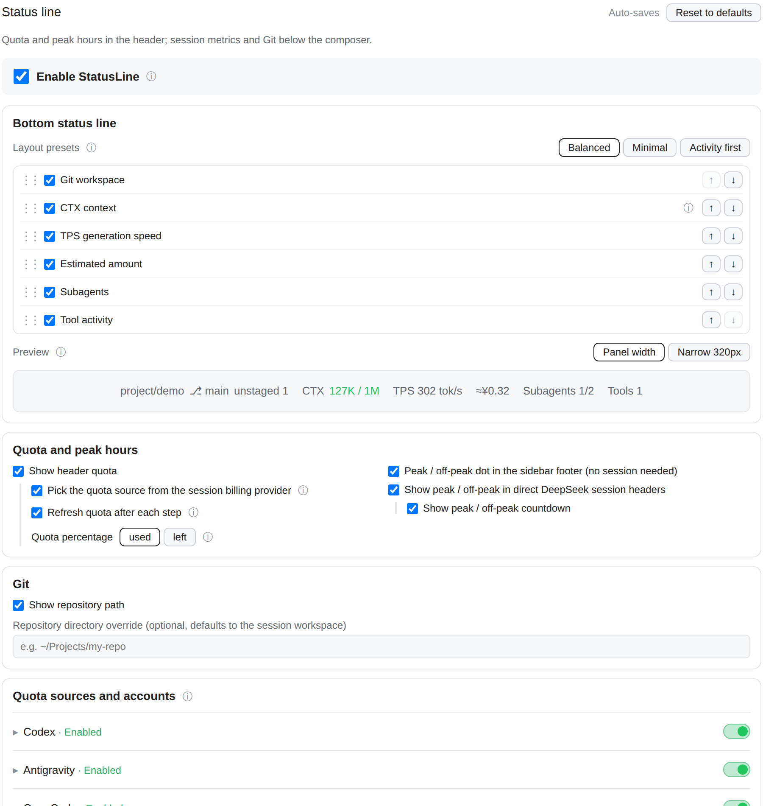

# dsh-statusline-plus

[](https://github.com/overact/dsh-statusline-plus/releases/tag/v0.1.1)
[](https://github.com/overact/dsh-statusline-plus/actions/workflows/verify.yml)

[English](#english) | [简体中文](#简体中文)

A responsive statusline plugin for DeepSeek Harness (`dsh web`). Displays account balances and subscription quotas (DeepSeek, Kimi Code, Z.ai/智谱, Anti Gravity, Codex, OpenCode Go, OpenRouter) in the top bar, and Git workspace state, context consumption, session cost, agent/tool activity, and streaming TPS above the composer dock.

<p align="center"></p>

<p align="center"> </p>

All screenshots use illustrative data rendered by the actual plugin UI; they contain no account or conversation data.

---

<a name="english"></a>
## 🌟 Key Features

- **💳 AI Subscription Quotas**:
  - **DeepSeek**: Official account balance, with separate CNY/USD amounts, granted/top-up details, and account availability.
  - **DeepSeek peak indicator**: Peak/off-peak status and live countdown beside the balance; click for a daily timeline, Beijing/local clocks, next switch and official pricing link. Local calculation starts only in visible direct DeepSeek sessions. A sidebar-footer dot (yellow peak, green off-peak, grey when the holiday calendar does not cover the year) shows the state with no session open; hover for the countdown, click for the same details. It replaces the separate `dsh-peak-indicator` plugin. Peak windows are built in from DeepSeek's official pricing page (verified 2026-10-02); the official wording is too loose to adopt a parse automatically. Instead the Host checks the page at most daily and compares its rule sentence with the built-in rule: on any mismatch the panel and the dot flag *rule may have changed* with a link. Holidays and make-up workdays come from [holiday-cn](https://github.com/NateScarlet/holiday-cn) (jsDelivr, raw GitHub fallback), validated and cached for 24 h in `~/.dsh/statusline-peak-cache.json`; the built-in 2025–2026 calendar is the fallback, and a year that is not published yet shows as unknown. Make-up weekend workdays stay off-peak (the official wording covers all weekends) and are noted in the details.
  - **Kimi Code**: 5h / 7d / monthly usage and reset times; supports both current official and older Coding Plan response formats.
  - **Z.ai / 智谱 (Z Code)**: International and mainland Coding Plan 5h / weekly usage, including token and credit window formats.
  - **Anti Gravity**: Official quota summary (5h rolling & weekly windows), multi-account priority routing, and token auto-refresh support.
  - **Codex**: Real-time quota & rate limits via local CLIProxyAPI (`~/.cli-proxy-api`).
  - **OpenCode**: Official OpenCode Go rolling 5h / weekly / monthly usage quotas.
  - **OpenRouter**: Credits & key balance tracking with low-balance alerts.

   

- **🌿 Git Workspace Diagnostics**:
  - Porcelain v2 parser with zero polling; displays branch, dirty state, added/deleted line counts (`+N/-M`), untracked files (`?N`), and merge conflicts.
  - Full support for local Git repositories and remote SSH workspaces.
- **⚡ Real-time Streaming TPS**:
  - Native DSH stream events via bounded SSE, with a 500ms minimum observation. Streaming character estimates use `≈`; retained previous rates and settled averages are labeled separately. Settlement prefers actual provider output usage and excludes tool execution waits.
- **Subagents and Cost Estimates**:
  - Compact finished/total Subagents summary, with unknown states marked explicitly; click for up to 12 agents, running/stopped/unknown counts, native cumulative activity times, one-shot/continuable mode and the last actually used model. Stopped entries fade to 50% opacity after 5 seconds and hide after 15 seconds; resumed agents reappear. Stopped does not imply success. Cold metadata loads only for visible details.
  - Session reference amounts (for example `≈$0.12`) from a replayable native projection, priced from the Host's bundled `pi-ai` vendor catalog without network requests. Subscription and gateway routes use the same underlying model's public API reference price. Exact request models, actual usage, caches, context tiers and DeepSeek request-time peak/off-peak timing are accounted for; uncertainty displays a range. Click for sources, catalog date, coverage and unpriced reasons.
- **Real Tool Activity**:
  - Native durable top-level and PTC tool call/result records, gated by the independent live session running status. The bar shows only a pending-call count (`Tools 3`); hover for up to two tool names, or click for up to 12 pending/recent calls, durations and known outcomes. The elapsed clock runs only in visible open details. History is bounded to 64 entries. No arguments, command text, response bodies or prompts enter this projection.
  - Durations span the call/dispatch record to result submission, including approval and waiting; they are not exact tool execution timings. Missing metadata and unknown outcomes remain unknown. Idle and cold unfinished records do not appear as live activity.
- **Quota Freshness**:
  - Fetch age and cache status stay in tooltips/details, keeping the header clear. The header resolves the session model from DSH's native model selection (known before the first request) and refreshes when a turn starts as well as after each step, so a new session shows its quota as the first step begins. Every quota/balance chip behaves the same: a click opens its details (windows, resets, balance components, freshness, a Refresh button) and forces one refresh on open; closing never bypasses the cache. A *Quota percentage* setting (used / left, default used) applies to every chip, tooltip and details panel alike; bars fill by the shown number while colour always tracks consumption. Failed refreshes keep the previous data and its original timestamp and mark the chip with `!`; failed loads become a click-to-retry chip. When no configured source matches the session's billing provider, the header stays empty.
- **🎨 Natural Responsive Layout**:
  - Natural wrapping by information groups, token values kept together, path ellipsis with full-path tooltip, and dividers suppressed at each line start. Header chips use at least 13px. Native dock statistics, the context ring and plugin metrics share at least 13px text and 20px line height, respecting larger DSH font preferences. Plain inline controls have 16px gaps, and TPS takes only the space its text needs. Viewport-bounded detail panels support narrow screens.
- **⚙️ Native DSH Settings**:
  - Full integration with DSH `settings` / `configForms` (`statusline-plus` namespace) with debounced auto-sync.
  - Groups: bottom status line, header quota/peak, Git, quota sources/accounts and advanced settings. The bottom component list (switches + ordering) is always visible; account cards and advanced parameters are folded. Long explanations live in ⓘ tooltips (hover or focus; a bottom sheet on narrow screens). Save status and a two-step *Reset to defaults* sit beside the title; reset restores display, layout, refresh and advanced preferences and keeps credential references, account files, the repository path and per-source switches.
  - Balanced, Minimal and Activity-first presets change only bottom component visibility and order. Drag the left handle with mouse/touch, or use arrow keys and up/down buttons to order all six plugin components; insertion markers show the drop position, and Escape cancels a drag. Drop updates preview and saves only the final order; hidden components keep their positions. Presets never change accounts, header settings or the native statistics group.
  - Instant draft preview shares the actual component rendering, with local example data, interactive example details and a 320px narrow view. Preview never queries quota or acquires sessions; configuration still saves through native debounced settings.
  - Native DSH's context ring uses the same `contextPressure` reading as CTX. The ring comes last in the native stats group on the left, followed by the plugin metrics with consistent gaps; CTX shows used tokens / window capacity without repeating the percentage.
  - The master enable switch is visually distinct. Dependent layout, source selection, peak countdown, workspace and account controls become inactive while preserving their preferences. Step refresh has one shared switch for all quota sources.

  

---

## 📦 Installation

Requires DeepSeek Harness **>=0.2.0-rc.2 and <0.3.0**; tested on **0.2.0-rc.2**. The package declares a `dsh.bundle`, so installing it registers the `statusline-plus` row; no manual `cordis.patch.yml` edit is needed.

```sh
dsh plugin --profile web add https://github.com/overact/dsh-statusline-plus/releases/download/v0.1.1/dsh-statusline-plus-0.1.1.tgz
# or pin the source tag
dsh plugin --profile web add github:overact/dsh-statusline-plus#v0.1.1
# or from a local clone
dsh plugin --profile web add file:/path/to/dsh-statusline-plus
```

Restart DSH when there are no active sessions, then refresh the browser. The plugin ships prebuilt files and needs no build step; source edits are not guaranteed to reload through configuration HMR.

`0.1.0` is the first public release; earlier private development snapshots used a different version sequence. See [release notes](CHANGELOG.md).

**Upgrading from a manual install:** earlier versions were registered by hand as `@local/dsh-statusline-plus`. Remove that `insert` row and the `@local/dsh-statusline-plus` dependency before installing, otherwise the row is registered twice. Existing `statusline-plus` settings keep working, because the row id is unchanged.

---

## ⚙️ Configuration

Settings can be managed directly in **DSH Web → Settings → Statusline (状态栏)** or persisted in `settings.yaml` under `statusline-plus`:

| Option | Type | Default | Description |
| :--- | :--- | :--- | :--- |
| `enabled` | `boolean` | `true` | Enable or disable the statusline plugin |
| `quotaAuto` | `boolean` | `true` | Automatically select quota source based on active provider |
| `quotaOnStep` | `boolean` | `true` | Shared step refresh preference for every quota source |
| `showDeepseekPeak` | `boolean` | `true` | Show peak/off-peak for direct DeepSeek billing routes |
| `deepseekPeakCountdown` | `boolean` | `true` | Show the local peak/off-peak countdown |
| `showCodexQuota` | `boolean` | `true` | Show Codex quota when active |
| `showOpenCodeQuota` | `boolean` | `true` | Enable OpenCode quota in automatic and manual selection |
| `showAntigravityQuota` | `boolean` | `true` | Show Anti Gravity quota when active |
| `antigravityAccount` | `string` | `""` | Specific credential filename (empty = auto by priority) |
| `showGit` | `boolean` | `true` | Show Git repository status badge |
| `showTps` | `boolean` | `false` | Show streaming estimate and settled TPS |
| `showContext` | `boolean` | `true` | CTX used tokens / capacity; native percentage ring comes last in native stats on the left |
| `showActivity` | `boolean` | `true` | Show direct child agent activity |
| `showTools` | `boolean` | `true` | Show real pending tool activity in a known running session |
| `showCost` | `boolean` | `true` | Show the session cost reference amount |
| `componentOrder` | `array` | `git, context, tps, cost, activity, tools` | Plugin bottom component order; missing IDs append and stale/duplicate IDs are removed |
| `cacheTtlMs` | `number` | `60000` | Successful quota result reuse time; UI uses seconds, effective minimum 15s |
| `providers` | `array` | Built-in sources | Provider overrides and custom balance / window endpoints |

DeepSeek works automatically for direct `deepseek` / `deepseek-official` sessions using the existing DSH `DEEPSEEK_API_KEY` credential. Kimi and Z.ai require their Coding Plan credentials. Provider rows let you change the credential **reference** and enable a source. One shared switch controls step refreshes for all accounts. Legacy mixed per-account preferences start with automatic step refresh off until you choose a shared value. Keys stay in DSH credentials on the Host.

Every source card includes an Enabled/Disabled preference badge, including Codex, Antigravity and OpenCode. Enabled text uses a soft theme-aware green; Disabled retains the neutral color. This is permission to display the source, not proof of login, valid credentials or current selection. Every card has an independent slider switch; enabling it opens its configuration automatically. Disabled sources keep their account settings.

The advanced cache and request-timeout settings are displayed in seconds (cache default 60, minimum 15; timeout default 10, 1–60), while configuration still stores milliseconds. Number fields commit on blur or Enter: out-of-range values clamp, blank or invalid input restores the saved value. TTL controls result reuse, not periodic polling: with step refresh enabled, a step requests the current quota and the Host reuses a fresh result; becoming visible also queries through cache. Expiry alone makes no request. All source types honor the cache on automatic steps; manual clicks bypass successful cache, while rate-limit/error backoff remains enforced. Concurrent requests for the same quota share one Host request. Shorter reuse times improve freshness at the cost of more upstream calls; supplier accounting may still update later.

| Source ID | Credential reference | Billing provider IDs |
| :--- | :--- | :--- |
| `deepseek` | `DEEPSEEK_API_KEY` | `deepseek`, `deepseek-official` |
| `kimi-code` | `KIMI_API_KEY` | `kimi-coding`, `kimi-code`, `kimi-for-coding` |
| `zai` | `ZAI_API_KEY` | `zai`, `z.ai`, `zai-coding-plan` |
| `zhipu` | `ZAI_CODING_CN_API_KEY` | `zai-coding-cn`, `zhipu`, `zhipu-coding`, `glm-coding`, `bigmodel` |

Built-ins match the billing provider, so a DeepSeek/Kimi/GLM model routed through OpenRouter keeps showing OpenRouter quota. Existing OpenRouter-only configurations gain the new presets automatically; partial overrides such as `{ id: deepseek, enabled: false }` are supported. Step refreshes respect the Host cache; opening a badge forces one refresh. Missing or invalid quota stays unknown.

Peak calculation uses Beijing time (UTC+8): weekdays excluding Chinese public holidays, 09:00–12:00 and 14:00–18:00 are peak windows. Other hours, weekends and holidays are off-peak at half the peak price. The built-in calendar covers 2025–2026; an uncovered year's possible weekday peak remains unknown, and the next peak is never guessed across an uncovered year. Peak display has its own toggle and works when balance display is disabled. It uses no API calls or credentials. Disable the standalone `dsh-peak-indicator` row after migration to avoid duplicate indicators; its source and browser preferences can be retained. This integrated mode follows the official schedule and native statusline settings.

Kimi international accounts can override `kimi-code.endpoints` with `url: https://api.kimi.ai/coding/v1/usages` and `parse: { mode: kimi-usage }`. Each Z.ai region uses its own endpoint and raw Authorization, following the official quota-query script. These Coding Plan interfaces may change independently of model APIs; ordinary Moonshot API wallet balances and monthly MCP tool-call budgets are outside this display.

Cost estimates first read the running Host's `@earendil-works/pi-ai/providers/all` public catalog, retaining only vendor input/output/cache prices and context tiers. Model matches are cached; there is no online pricing query or polling. OpenCode Go, Codex and other subscriptions use the underlying model vendor's public API reference price, independent of their own subscription/gateway rate cards or quota rules. Verified model aliases identify the model without guessing another version. All-zero catalog placeholders remain unknown. Sparse fallbacks cover GPT-6.1 Sol and Claude Sonnet 5.5 (official prices verified **2026-10-04**), plus the existing DeepSeek CNY snapshot (**2026-10-02 04:24:12 UTC**) when native coverage is absent. Fallback use is identified in details. USD and CNY accumulate separately without exchange-rate conversion. Current catalog prices value historical usage as a reference, not a historical invoice; the DeepSeek CNY fallback still excludes records before its verification cut. Missing usage, unknown cache rates or models remain unpriced with a reason; a subtotal retains the unpriced count. The catalog date/version and record counts are shown in details. Catalogs may lag vendor updates; catalog changes invalidate native checkpoints on the next Host load. Custom endpoint bills, subscription charges, tools, cache TTL/storage fees, child sessions and inherited fork history are outside this estimate.

The compact cost panel uses the statusline context panel's segmented bar and matching color legend to show uncached Input, Cache (reads + writes), and Output token counts, amounts and shares of the priced subtotal. Counts use K/M notation, with exact values on hover; unpriced requests are excluded, and older Hosts show `—` until reloaded. Amounts display two decimals while accounting retains integer precision. Range shares and bar widths use interval midpoints and show `≈`; currencies stay separate. Source metadata and pricing explanations appear in the ⓘ hint. Breakdown values and token counts are accumulated during native usage settlement, without scanning session history when the panel opens. The 224px panel keeps table headers accessible while hiding them visually to save height.

Automatic Git refreshes share in-flight work and coalesce bursts into a one-second trailing refresh; manual clicks bypass the delay and the Host's one-second snapshot cache. Hiding/unmounting or changing the session/workspace cancels pending work. SSH bridge changes invalidate cached snapshots. Collapsed Subagents use only compact running-state keys and cached baseline membership sets; hidden pages skip selectors, and an open panel reads model/effort/timing only for up to twelve visible children. The cost wire carries session totals and breakdowns without duplicating unused per-turn amounts.

DeepSeek reference pricing reuses the peak indicator's windows and locally cached holiday calendar, applying the tariff at each request's time on every channel. The pricing projection takes a compact, stable calendar snapshot at Host load; it retains only windows, holiday dates and rule status, and adds no fetch. A changed calendar invalidates checkpoints on the next load. Crossing a possible tariff boundary gives a range; unknown years or an official-rule mismatch stay unpriced. The indicator can refresh its existing cache independently. Kimi aliases `k3` / `k3-256k` and `kimi-for-coding-highspeed` map to their vendor model IDs; the rolling `kimi-for-coding` alias is not assigned an older model's price ([official model identities](https://www.kimi.com/code/docs/en/kimi-code/models.html)).

The Subagents chip shows finished/total from the full native catalog; expired detail rows still count toward progress, and unknown children are excluded from the numerator. The entire chip hides when all finished detail rows expire. Subagents uses native `subagentCatalog`, independent session status, `subagentTiming` and `modelSelection.lastUsed`; missing state never becomes “stopped,” and a model or reasoning effort selected for a future request is not presented as already used. Its compact panel gives each title the full row (up to two lines), with smaller model/effort and status/timing rows, and caps list height. Missing effort metadata stays hidden. Each stop observed by the Client starts a 5-second fade / 15-second expiry, without modifying the native catalog or session history. One deadline timer serves all stopped children and pauses while hidden; active or unknown children remain visible. Tool activity uses the `statuslineToolActivity` native replayable projection; it excludes inherited fork history and stops its local elapsed clock when hidden or no calls remain pending. Quota age means successful retrieval time, not the provider's internal accounting update time. Its expiry matches the Host's effective cache TTL (at least 15 seconds) and adds no account polling.

The component approach takes inspiration from [ccstatusline's widgets](https://github.com/sirmalloc/ccstatusline/blob/35440e4a93ac8aba7e57973ac004a68adcc51089/src/types/Widget.ts) and [Claude HUD's bounded activities](https://github.com/jarrodwatts/claude-hud/blob/33b51db6ceb5d0c91dc9c22404abcabacc8603b0/src/render/activity.ts), adapted to the DSH Web slots. No external layout plugin is installed.

---

## 🧪 Testing

```sh
npm run check   # Syntax validation
npm test        # Run offline unit and native integration tests
```

Tests run completely offline using fixtures and mock responses without calling remote APIs.
Tests can target a specific installed DSH runtime using `DSH_PACKAGE_DIR`; the current integration was checked against DSH `0.2.0-rc.2`.

The account integration follows [DeepSeek's balance API](https://api-docs.deepseek.com/api/get-user-balance/), [Kimi's official usage parser](https://github.com/MoonshotAI/kimi-code/blob/21406fb4c805cc8c715e6d1f16ad3fb5f25f4fe3/packages/oauth/src/managed-usage.ts), and [Z.ai's official quota-query script](https://github.com/zai-org/zai-coding-plugins/blob/0446d0bb0bc537d97d3ab3664c4b8b9c4a0e1254/plugins/glm-plan-usage/skills/usage-query-skill/scripts/query-usage.mjs). Related implementations inspected: [DSH provider quota](https://github.com/jasper-zsh/dsh-plugin-provider-quota) and [CC Switch](https://github.com/farion1231/cc-switch/blob/67d1daa1af12478d5be39761812a89398c44f463/src-tauri/src/services/coding_plan.rs).

---

<a name="简体中文"></a>
## 简体中文说明

DeepSeek Harness (`dsh web`) 增强版状态行插件，专为 DSH 网页端打造：

### 核心功能

<p></p>
<p> </p>
<p>所有截图使用实际插件界面和示例数据，不包含账号或真实对话信息。</p>
<p> </p>
<p></p>

1. **多源套餐额度监控**：
   - **DeepSeek**：自动读取现有 `DEEPSEEK_API_KEY` 引用，展示官方余额；各币种独立显示，悬停查看赠送/充值明细和账户可用状态。
   - **峰/平峰指示器**：集成原 `dsh-peak-indicator` 的官方时段逻辑，在 DeepSeek 直连会话的余额旁展示状态和秒级倒计时；点击查看当天时间轴、双时钟、下次切换及官方价格链接。计算完全在浏览器本地进行，页面隐藏后停止计时。侧栏左下角另有一个指示点（黄=高峰、绿=平峰、灰=日历未覆盖），不打开会话也能看到；悬停显示倒计时，点击查看同样的详情，取代独立的 `dsh-peak-indicator` 插件。峰谷时段按 DeepSeek 官方定价页内置（2026-10-02 核对）；官网措辞较宽泛，不自动采用解析结果，而是由宿主最多每天检查一次官网说明句并与内置规则比对，不一致时详情与指示点提示“规则可能已变更”并给出官网链接。节假日与调休来自 [holiday-cn](https://github.com/NateScarlet/holiday-cn)（jsDelivr 优先，raw GitHub 兜底），校验后缓存 24 小时于 `~/.dsh/statusline-peak-cache.json`；获取失败时回退内置 2025–2026 日历，尚未公布的年份显示“时段未核实”。调休上班的周末按官方“周末全天平峰”仍显示平峰，并在详情中注明。日历覆盖到 2026 年，未知年份不猜测高峰或切换时间。
   - **Kimi Code**：支持新版与旧版响应，展示 5h / 7d / 月度已用比例和重置时间，默认凭据引用为 `KIMI_API_KEY`。
   - **智谱 / Z.ai（Z Code）**：支持国际站与大陆站 Coding Plan 的 5h / 周额度，兼容 `TOKENS_LIMIT` 和 `CREDIT_LIMIT`；分别使用 `ZAI_API_KEY` / `ZAI_CODING_CN_API_KEY`。
   - **Anti Gravity**：展示官方 5h 滚动与周额度，支持多账号优先级调度、Token 自动刷新与额度看板弹窗。
   - **Codex**：通过本地 CLIProxyAPI (`~/.cli-proxy-api`) 实时读取套餐额度与使用窗口。
   - **OpenCode**：调用官方 usage 端点，展示 OpenCode Go 的 5h / 周 / 月滚动额度。
   - **OpenRouter**：支持 Credits 与 Key 余额查询，低余额标红预警。
2. **Git 工作区状态诊断**：
   - 基于 Porcelain v2 零轮询驱动，实时展示分支、暂存与未暂存代码改动行数（`+N/-M`）、未跟踪文件（`?N`）、合并冲突等。
   - 深度兼容本地工作区与 SSH 远程仓库映射。
3. **原生实时流式 TPS**：
   - 接入 DSH 原生 `agent/assistant-stream` 帧与同源 SSE 通道，500ms 观察窗口平滑抖动，会话隔离。
4. **原生设置面板集成**：
   - 接入 DSH 0.2 系列的 `configForms`（命名空间 `statusline-plus`），已在 0.2.0-rc.2 验证；在 Web 设置页调节开关与参数。
   - 内置来源按实际计费 provider 匹配；经 OpenRouter 使用 DeepSeek 模型时仍显示 OpenRouter 额度。旧配置自动补全新增预设，可在来源列表修改凭据引用、停用来源或设置低余额阈值。
   - 峰/平峰显示和倒计时可独立开关；关闭余额显示后仍可显示时段。迁移完成后可停用独立 `dsh-peak-indicator` row，保留源码和旧浏览器偏好，避免重复提示。
   - 顶部按 DSH 原生的模型选择解析会话模型（首个请求前即可知），并在每轮开始与每个 step 结束时刷新，新会话在第一个 step 开始时即显示额度。顶部只显示额度/余额。所有额度芯片交互一致：点击展开详情（窗口、重置时间、余额构成、更新时间与“刷新”按钮），仅在展开时强制刷新一次，收起不绕过缓存。设置中的“额度百分比”（已用 / 剩余，默认已用）同时作用于芯片、悬停提示和详情；进度条按显示的数值填充，颜色始终按已用程度变化。刷新失败保留原值和原时间并以 `!` 标记；加载失败的芯片可点击重试。会话计费平台没有匹配的额度来源时，顶部不显示任何占位。

Subagents 主栏显示“已结束数/总数”，未知状态单独提示；点击最多展示 12 个直接子代理，含停止/未知计数、活动时长、单次/可继续模式及最近实际使用的模型。客户端观察到停止后，5 秒变为 50% 不透明度，15 秒后隐藏；重新运行立即恢复。仅使用一个截止时间计时器，后台标签页暂停计时器，返回时按实际经过时间处理。停止不等于成功；为下一次请求选择的模型不会被当成已使用模型。

真实工具活动读取原生顶层及 PTC 调用/结果事件，并核验当前会话确实在运行。主栏只显示待结算数量（如 `工具 3`），悬停最多查看两个工具名；点击详情最多 12 条，显示名称、时长和状态，历史有界保存 64 条。时长计时器只在页面可见且详情打开时运行。只投影工具名、调用身份、时间和状态，不读取参数、命令、响应正文或提示词。显示时间含审批与等待，并非纯执行耗时；空闲及冷历史未结算记录不冒充实时活动。

所有来源卡片统一显示启用/停用偏好，包括 Codex、Antigravity、OpenCode；启用文字使用随主题调整的柔和浅绿色，停用保持原中性色。这个标识表示允许显示该来源，不表示已登录、凭据有效或当前被选中。每个来源都提供独立滑块开关，切换为启用时自动展开配置；停用后保留账号设置。

高级设置中的缓存时间与请求超时均以秒显示（缓存默认 60 秒、最少 15 秒；超时默认 10 秒、1–60 秒），底层仍保存毫秒以兼容已有配置。数字框在失焦或回车时提交：超出范围自动夹到边界，清空或非法输入恢复为已保存值。它控制结果复用时间，到期本身不发起轮询：启用 step 刷新后，step 结束会查询当前额度，未过期时由 Host 返回缓存；页面重新可见也按缓存查询。各来源的自动 step 查询统一遵守缓存；点击仍绕过成功缓存，但错误/限流退避不会被绕过。同账号并发查询合并为一次。缩短缓存能改善新鲜度，也会增加平台请求；平台自身记账仍可能延迟。

设置中提供“均衡 / 精简 / 活动优先”预设，六个底部组件的显示开关统一放在排序列表中。左侧手柄支持鼠标/触摸拖拽，显示插入位置，Esc 取消；手柄支持键盘 ↑↓，并保留上移/下移按钮。放下后更新预览并自动保存最终顺序，隐藏后仍保留顺序；预设只更改底部组件的显示与顺序。即时预览与实际栏共用组件，用本地示例数据支持详情点击及 320px 窄屏检查，不读取账号或会话。账号、顶部选项和原生信息组不受预设影响。

状态行显示会话累计 API 参考金额（如 `≈$0.12`），优先读取正在运行的宿主内置 `pi-ai` 厂商目录，不在线查询价格，也不轮询。只保留厂商价目，并缓存模型匹配结果；OpenCode Go、Codex 等订阅与直连统一按底层模型厂商的公开 API 单价估值，不采用订阅／渠道价目或额度倍率。仅使用已核实的模型别名，不猜测其他版本的价格。支持缓存及长上下文档位，人民币和美元分别累计，不换算汇率。详情展示目录版本、生成时间、fallback 使用数量及未计价原因。少量新模型缺失时使用已核验的官网 fallback（GPT-6.1 Sol／Claude Sonnet 5.5，2026-10-04），DeepSeek 原人民币快照（2026-10-02）也保留作 fallback。目录本身可能晚于厂商更新；当前目录用于历史 token 的参考估值，不能当作历史账单。缺少 usage、缓存单价或对应模型时保留未计价原因，不含工具费、缓存 TTL／存储费、Subagents 与 fork 继承历史，不代表实际扣款。

DeepSeek 参考价复用 peak indicator 的时段规则和已有节假日缓存，所有渠道均按每次请求发生时的峰谷时段估值。费用投影在宿主加载时只保存时段、节假日日期与规则状态的稳定快照，不新增请求；目录或日历更新在下次加载时触发原生投影重新计算。跨时段边界显示范围，日历年份未知或官方规则发生变化时保留未计价；指示器原有缓存刷新独立运行。Kimi 的已核实别名映射到厂商模型，滚动升级的 `kimi-for-coding` 不沿用旧版模型单价。

费用面板参考 statusline 上下文展开面板，用分段柱状图与对应色标展示 Input（未缓存输入）、Cache（缓存读取与写入）及 Output 的 token 数量、金额与已计价占比。数量使用 K／M 单位，悬停显示精确值，仅统计已计价请求；旧宿主重载前显示 `—`。金额显示两位小数，内部累计保留整数精度；区间金额的占比及图表宽度按中值估算，占比标注 `≈`，不同币种分别计算。来源版本、日期与长说明收进 ⓘ。明细与 token 数随原生 usage 结算累计，打开面板不扫描会话记录。面板宽度收至 224px，表头保留给辅助阅读工具，视觉上隐藏以缩短高度。Subagents 进度显示已结束／总数，已结束条目隐藏后仍计入进度，未知状态不计为已结束；全部条目过期后隐藏整组。面板收紧宽度与列表高度，标题占整行、最多显示两行，模型／推理强度与状态／耗时用较小字号分层；推理强度只读取最近实际请求的记录，缺失时不猜测。

Git 自动刷新合并在途请求，并把密集触发合并为约一秒后的最后一次刷新；手动点击绕过延迟及宿主的一秒快照缓存。页面隐藏、卸载或切换会话／工作区时取消待执行任务，SSH bridge 变化时清除缓存。Subagents 收起时只使用紧凑状态键和集合查找，隐藏页面跳过选择器，展开后仅读取最多十二个可见子会话的模型／推理强度／计时明细。费用传输只保留会话合计与分项，不再重复发送未使用的回合金额。

布局借鉴 ccstatusline 的组件组织和 Claude HUD 的有界摘要，适配现有 DSH Web 插槽；按组自然换行，行首不留分隔线，token 数值保持完整。顶部字体至少 13px，底部至少 13px、20px 行高；统一间距 16px；峰/平峰框使用更明显的状态底色。TPS 展示区分字符估算（≈）、暂留上次值和完成/中断后的均值，工具执行等待不计入生成速度。

原生上下文圆环放在原生统计组末尾，显示占用比例及容量/构成详情；CTX 显示已用量 / 窗口容量，数值以绿、黄、红表示占用程度。设置分为底部状态行、顶部额度与峰谷、Git、额度来源与账号、高级设置；底部组件列表（开关 + 排序）始终展开，来源账号与高级参数默认折叠，长说明收进 ⓘ 提示（悬停或聚焦显示，窄屏为底部浮层），保存状态与“恢复默认”按钮在标题旁：点击两次确认，只恢复显示、布局、刷新与高级设置，保留凭据引用、账号文件、仓库路径与各来源开关。Off-peak 标签不显示折扣数字，完整规则仍可在详情查看。
   - 自动刷新遵守宿主缓存，展开读数时强制刷新一次；未配置或无效数据保持未知，不显示成零余额/零用量。密钥只在宿主侧解析。

---

## 📄 License

[MIT](LICENSE)


## Development verification

Use the existing `check` and `test` commands through the short-report runner.
Explicit file paths restrict verification to the current edit even when the
working tree contains earlier uncommitted work:

```sh
npm run verify -- --files lib/client.js --ui cost
npm run verify -- --files lib/client.js --style-only --ui cost
npm run verify -- --files lib/model-pricing.js
npm run verify -- --files lib/client.js --ui subagents --plan
npm run verify:all
npm run screenshots  # Refresh the public demo images without accounts or sessions
```

`--style-only` is for CSS edits only; it retains the browser check and omits
behavior tests. `--ui none` disables UI verification for a backend-only check.
Without `--files`, the runner considers tracked and untracked changes against
HEAD. `--plan` prints the selection without executing it. Unknown runtime files
and manifest changes select the full suite. A stage ends with one full run;
subsequent failures or new changes need only their affected checks until the
stage is ready again.

The browser runner has a separate, locked development dependency set; it does
not replace the plugin's DSH dependency or add production dependencies:

```sh
npm run ui:install
node tools/ui/node_modules/playwright/cli.js install chromium
npm run verify:ui -- --panel cost
npm run verify:ui -- --panel subagents
npm run verify:ui
```

It uses installed Google Chrome when available, otherwise Playwright Chromium.
`PLAYWRIGHT_CHROMIUM_EXECUTABLE_PATH` selects an explicit browser executable.
Each invocation shares one browser between selected panels and closes it after
verification. The default fixture loads the actual client code and real React
with synthetic session metadata, makes no HTTP requests, and checks cost rows,
K/M counts, bar proportions, narrow-screen clipping, Subagents progress,
fade/expiry/resumption and model/effort spacing. It covers these two panels;
other UI changes need their own browser checks.

An authorised live check is optional and requires a specific existing session:

```sh
npm run verify:ui -- --live --session SESSION_ID --panel all
```

The live adapter targets DSH 0.2.0-rc.2's module-loader/context shape. It reads a
local login URL from `DSH_AUTH_URL` or the user journal (`--service dsh-web` by
default), keeps authentication out of reports, navigates only the selected
session, and opens the requested panels. It submits no model prompts, changes
no settings and never restarts DSH. Credentials and live session state are
checked afresh; static-document reuse does not apply to them.

Reports are compact JSON; full logs and screenshots live under the ignored
`output/playwright/` directory. Failure excerpts are capped and credentials are
redacted. A subprocess that exits without a test/report summary fails the check.
CI runs the existing syntax checks and full tests, adds the offline browser
check for affected UI/tooling files, and retains reports for seven days.

开发时按本次改动选择检查：纯 CSS 使用 `--style-only`，交互改动保留相关测试，
阶段结束运行一次 `verify:all`。优先读简短报告，失败时再查对应日志。
同一任务内复用已读且未变化的资料；文件、分支、版本或任务范围变化时重新核对。
运行中会话与认证信息始终实时检查。内部 agent 指令和工作日志不进入发布包。
