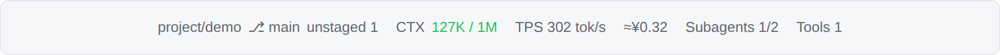
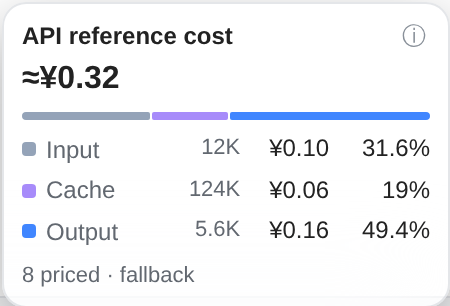
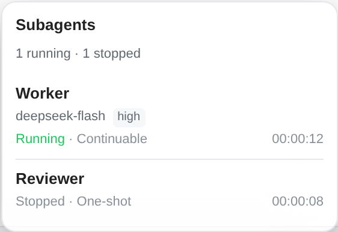

# dsh-statusline-plus

[](https://github.com/overact/dsh-statusline-plus/releases/tag/v0.1.1)
[](https://github.com/overact/dsh-statusline-plus/actions/workflows/verify.yml)

[English](#english) | [简体中文](#简体中文)

<a id="english"></a>
A responsive statusline for DeepSeek Harness (`dsh web`). Account quotas appear in the header; workspace and session metrics appear beside the composer.

<p></p>
<p> </p>

Screenshots use the actual UI with sample data, without account or conversation data.

## Features

- **Balances and quotas:** DeepSeek, Kimi Code, Z.ai / 智谱, Antigravity, Codex, OpenCode Go and OpenRouter. Click a chip for details and refresh.
- **DeepSeek peak hours:** status, countdown and daily timeline, plus a sidebar indicator. Unverified schedules stay unknown.
- **Workspace and session:** Git branch and changes, context usage, streaming TPS, API reference cost, direct child agents and tool activity.
- **Layout:** component switches, ordering, presets and an interactive preview. Groups wrap on narrow screens; an optional switch disables the bottom status line at widths up to 480px.

## Installation

Requires DSH **>=0.2.0-rc.2 and <0.3.0**; tested on **0.2.0-rc.2**. Install the published release:

```sh
dsh plugin --profile web add https://github.com/overact/dsh-statusline-plus/releases/download/v0.1.1/dsh-statusline-plus-0.1.1.tgz
```

For development, install a local clone with `dsh plugin --profile web add file:/path/to/dsh-statusline-plus`. The bundle registers its own plugin row and ships prebuilt files. With HMR enabled, plugin switches and settings apply live; linked source changes also hot reload when their directory is watched. Refresh the browser afterward. Restart DSH only when installation or an upgrade reports `restart-required`, and wait until no sessions are active.

For an earlier manual installation, remove the `@local/dsh-statusline-plus` row and dependency first to avoid duplicate registration. Existing `statusline-plus` settings remain compatible. See [release notes](CHANGELOG.md).

## Settings

Open **DSH Web → Settings → Statusline**. Settings are saved under `statusline-plus` in the native profile.

| Setting | Default | Effect |
| --- | --- | --- |
| `enabled` | `true` | All plugin displays and refreshes |
| `hideBottomOnNarrow` | `false` | At viewport widths ≤480px, unmount the bottom status line and stop its client activity; restore it when wider |
| `showGit`, `showContext`, `showCost`, `showActivity`, `showTools` | `true` | Individual bottom components |
| `showTps` | `false` | Streaming speed |
| `componentOrder` | Git, context, TPS, cost, activity, tools | Bottom component order |
| `showQuota`, `quotaAuto`, `quotaOnStep` | `true` | Header quotas, provider selection and shared step refresh |
| `showDeepseekPeak`, `deepseekPeakCountdown`, `showPeakDot` | `true` | DeepSeek peak indicators and countdown |
| `cacheTtlMs` | `60000` | Quota result reuse; UI displays seconds, effective minimum 15s |
| `fetchTimeoutMs` | `10000` | Request timeout; UI displays seconds |
| `providers` | Built-in sources | Credential references, source switches and endpoint overrides |

The narrow-screen switch is in **Bottom status line**. It affects this plugin's bottom components; header quotas, peak indicators and native composer stats remain available. It is available on `main`; the published v0.1.1 release asset is unchanged.

DeepSeek reuses `DEEPSEEK_API_KEY`; Kimi uses `KIMI_API_KEY`; Z.ai and 智谱 use `ZAI_API_KEY` and `ZAI_CODING_CN_API_KEY`. Other sources use their existing Host credentials or account integrations. Configure credential references, never literal keys. Keys stay on the Host.

Presets change bottom components only. Reset restores display, layout and refresh preferences while retaining credential references, account files, repository paths and per-source switches.

## Limits

- Quota refreshes reuse cached results; expiry alone does not poll. Manual refresh bypasses successful cache, while error/rate-limit backoff still applies. Missing or invalid data stays unknown.
- Cost is an estimate from actual usage and the model vendor's public API prices, including cache rates where known. Subscriptions use the same reference prices. USD and CNY remain separate; missing prices stay unpriced. It excludes child sessions, inherited fork history and extra fees, and does not represent an account charge.
- TPS distinguishes character estimates from settled output-token rates. Tool durations include approval and waiting. Subagents show direct children; stopped does not imply success.
- Provider APIs and price catalogs may change independently. DeepSeek's calendar has a built-in 2025–2026 fallback; uncovered schedules are not guessed.

<a id="简体中文"></a>
## 简体中文

DSH 网页端状态行：顶部显示账号余额与套餐额度，输入区显示 Git、上下文、TPS、API 参考金额、Subagents 和工具活动。支持 DeepSeek、Kimi Code、Z.ai／智谱、Antigravity、Codex、OpenCode Go、OpenRouter，以及 DeepSeek 峰谷时段指示。

**安装：** 需要 DSH >=0.2.0-rc.2 且 <0.3.0，使用上面的安装命令；插件自带预构建文件和注册配置。启用 HMR 后，插件启停与设置实时生效；本地源码目录纳入监听时也可热加载，之后刷新浏览器。安装或升级提示 `restart-required` 时，才需等待无活跃会话后重启。旧版手动安装请先移除 `@local/dsh-statusline-plus` 注册行和依赖，避免重复。

**设置：** 打开 **DSH Web → 设置 → Statusline（状态栏）**，调整显示、排序、预设、顶部额度、账号来源及缓存。密钥仅在宿主侧解析，设置里填写凭据引用。

**窄屏：** 在“底部状态行”中开启“窄屏时隐藏底部状态行”（`hideBottomOnNarrow`，默认关闭）。窗口宽度 ≤480px 时不挂载底部组件，停止相关客户端刷新与计时；变宽后自动恢复。顶部额度、峰谷指示与原生输入区统计仍可使用。此开关已加入 `main`；已发布的 v0.1.1 安装包保持不变。

**说明：** 费用按模型厂商 API 单价估算，不代表实际扣款，不含子代理与额外费用；人民币和美元分别累计。额度缓存到期本身不会轮询，失败保留上次结果，未知值不显示成零。工具耗时包含审批与等待；子代理停止不等于成功。恢复默认保留凭据引用、账号、仓库路径和各来源开关。

## Development verification

```sh
npm run verify -- --files lib/client.js --ui responsive
npm run verify -- --files lib/client.js --ui cost
npm run verify -- --files lib/client.js --style-only --ui subagents
npm run verify:all
npm run screenshots
```

Use explicit paths for the current edit. `--style-only` is for CSS only; `--ui none` skips browser checks; `--plan` previews the selection. Run `verify:all` once at the completed stage. `npm run check` and `npm test` are also available; `DSH_PACKAGE_DIR` selects an installed DSH runtime for integration tests.

Browser checks use real React and the client bundle with offline fixtures. Coverage includes cost, Subagents and responsive settings/resource cleanup. Install browser tooling only if missing:

```sh
npm run ui:install
node tools/ui/node_modules/playwright/cli.js install chromium
npm run verify:ui -- --panel responsive
```

The runner uses installed Chrome or Playwright Chromium; `PLAYWRIGHT_CHROMIUM_EXECUTABLE_PATH` overrides the executable. Reports and screenshots go to ignored `output/playwright/`.

An optional authorized, read-only live check requires an existing session: `npm run verify:ui -- --live --session SESSION_ID --panel all`. It opens cost/Subagents panels without changing settings, submitting prompts or restarting DSH. Local login comes from `DSH_AUTH_URL` or the user service journal; authentication is redacted. Responsive settings checks run offline only.

[MIT License](LICENSE)
